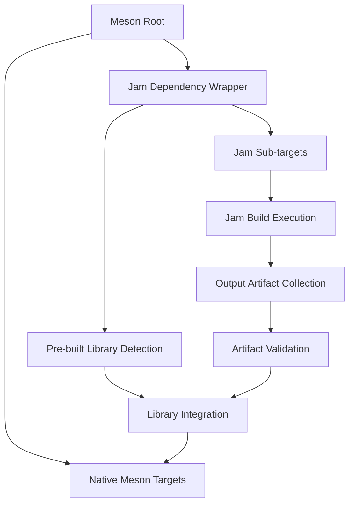

# Meson-Jam Hybrid Build Strategy for Haiku Dependencies

## Overview

This document outlines a comprehensive strategy for handling dependencies that are still built by Jam while migrating components to Meson. This hybrid approach enables incremental migration while maintaining full build functionality and dependency resolution.

## Table of Contents

1. [Strategy Overview](#strategy-overview)
2. [Core Concepts](#core-concepts)
3. [Implementation Patterns](#implementation-patterns)
4. [Dependency Categories](#dependency-categories)
5. [Build Integration Mechanisms](#build-integration-mechanisms)
6. [Caching and Performance](#caching-and-performance)
7. [Cross-Architecture Support](#cross-architecture-support)
8. [Error Handling and Validation](#error-handling-and-validation)
9. [Migration Workflow](#migration-workflow)
10. [Examples and Templates](#examples-and-templates)

## Strategy Overview

### Hybrid Build Architecture



### Key Principles

1. **Incremental Migration**: Allow Jam and Meson to coexist during transition
2. **Dependency Isolation**: Jam-built dependencies are encapsulated and exposed as standard Meson dependencies
3. **Build Caching**: Avoid rebuilding Jam dependencies unnecessarily
4. **Cross-Compilation**: Support multiple architectures with consistent patterns
5. **Error Propagation**: Clear error reporting from Jam builds to Meson
6. **Performance**: Parallel execution where possible

## Core Concepts

### 1. Jam Dependency Wrapper

A Meson function that encapsulates Jam target building and exposes the result as a standard dependency:

```meson
jam_dependency = jam_build_dependency(
    target: 'libroot.so',
    jamfile_dir: 'src/system/libroot',
    output_files: ['libroot.so'],
    architecture: get_option('target_arch'),
    rebuild_conditions: ['source_changed', 'config_changed']
)
```

### 2. Build State Management

Track Jam build state to enable intelligent caching and dependency resolution:

```meson
jam_state = {
    'last_build_time': timestamp,
    'source_hash': sha256_hash,
    'config_signature': config_hash,
    'output_artifacts': artifact_list,
    'architecture': target_arch
}
```

### 3. Artifact Collection

Systematic collection and validation of Jam build outputs:

```meson
jam_artifacts = {
    'libraries': ['libroot.so', 'libnetwork.so'],
    'headers': ['public_headers/', 'private_headers/'],
    'tools': ['rc', 'collectcatkeys'],
    'data': ['catalogs/', 'resources/']
}
```

## Implementation Patterns

### 1. Basic Jam Dependency Function

```meson
# File: build/meson/jam_integration.meson

function jam_build_dependency(
    target_name : 'libroot.so',
    jamfile_dir : 'src/system/libroot',
    output_files : ['libroot.so'],
    include_dirs : ['headers/'],
    architecture : 'x86_64',
    jam_flags : ['-q'],
    cache_key : '',
    rebuild_check : 'auto'
)
    # Calculate cache key if not provided
    if cache_key == ''
        source_files = run_command(['find', jamfile_dir, '-name', '*.cpp', '-o', '-name', '*.c', '-o', '-name', 'Jamfile'], check: false).stdout().strip().split('\n')
        config_data = '@0@-@1@-@2@'.format(target_name, architecture, jam_flags)
        cache_key = files(source_files).hash() + config_data.hash()
    endif
    
    # Build directory for this specific target and architecture
    jam_build_dir = meson.current_build_dir() / 'jam_builds' / architecture / target_name.underscorify()
    jam_output_dir = jam_build_dir / 'output'
    jam_state_file = jam_build_dir / 'build_state.json'
    
    # Check if rebuild is needed
    rebuild_needed = check_jam_rebuild_needed(
        state_file: jam_state_file,
        source_dir: jamfile_dir,
        cache_key: cache_key,
        output_files: output_files
    )
    
    if rebuild_needed
        jam_build_result = run_jam_build(
            target: target_name,
            source_dir: jamfile_dir,
            build_dir: jam_build_dir,
            output_dir: jam_output_dir,
            architecture: architecture,
            flags: jam_flags
        )
        
        # Update build state
        update_jam_build_state(
            state_file: jam_state_file,
            cache_key: cache_key,
            artifacts: jam_build_result.artifacts,
            timestamp: jam_build_result.timestamp
        )
    endif
    
    # Create Meson dependency from Jam outputs
    return create_dependency_from_jam_artifacts(
        name: target_name,
        output_dir: jam_output_dir,
        libraries: output_files,
        include_dirs: include_dirs,
        architecture: architecture
    )
endfunction
```

### 2. Advanced Jam Build Executor

```meson
# File: build/meson/jam_executor.meson

function run_jam_build(
    target : 'libroot.so',
    source_dir : 'src/system/libroot',
    build_dir : '/path/to/build',
    output_dir : '/path/to/output',
    architecture : 'x86_64',
    flags : ['-q']
)
    # Ensure build directories exist
    run_command(['mkdir', '-p', build_dir, output_dir], check: true)
    
    # Set up Jam environment
    jam_env = environment()
    jam_env.set('HAIKU_TOP', meson.project_source_root())
    jam_env.set('HAIKU_OUTPUT_DIR', meson.project_build_root() / 'generated')
    jam_env.set('HAIKU_OBJECT_DIR', meson.project_build_root() / 'generated' / 'objects')
    jam_env.set('HAIKU_PACKAGING_ARCH', architecture)
    jam_env.set('TARGET_PACKAGING_ARCH', architecture)
    
    # Architecture-specific environment
    if architecture == 'x86_64'
        jam_env.set('HAIKU_CC_x86_64', get_option('cross_cc_x86_64'))
        jam_env.set('HAIKU_C++_x86_64', get_option('cross_cxx_x86_64'))
        jam_env.set('HAIKU_LINK_x86_64', get_option('cross_link_x86_64'))
    elif architecture == 'aarch64'
        jam_env.set('HAIKU_CC_aarch64', get_option('cross_cc_aarch64'))
        jam_env.set('HAIKU_C++_aarch64', get_option('cross_cxx_aarch64'))
        jam_env.set('HAIKU_LINK_aarch64', get_option('cross_link_aarch64'))
    endif
    
    # Find Jam executable
    jam_exe = find_program('jam', dirs: [
        meson.project_source_root() / 'buildtools' / 'jam' / 'bin.linuxx86',
        '/usr/bin',
        '/usr/local/bin'
    ])
    
    # Execute Jam build
    jam_cmd = [
        jam_exe,
        '-f', meson.project_source_root() / 'Jamfile',
        '-s', 'HAIKU_OUTPUT_DIR=' + meson.project_build_root() / 'generated',
        '-d', '2',  # Debug level for dependency tracking
        flags,
        target
    ]
    
    jam_result = run_command(
        jam_cmd,
        env: jam_env,
        workdir: meson.project_source_root(),
        check: false,
        timeout: 3600  # 1 hour timeout for complex builds
    )
    
    if jam_result.returncode() != 0
        error('Jam build failed for target @0@:\n@1@'.format(target, jam_result.stderr()))
    endif
    
    # Collect build artifacts
    artifacts = collect_jam_artifacts(
        output_dir: meson.project_build_root() / 'generated',
        target: target,
        architecture: architecture
    )
    
    # Copy artifacts to our output directory
    copy_artifacts_result = run_command([
        'python3', 
        meson.project_source_root() / 'build' / 'meson' / 'copy_jam_artifacts.py',
        '--source', meson.project_build_root() / 'generated',
        '--dest', output_dir,
        '--target', target,
        '--arch', architecture,
        '--artifacts', artifacts.join(',')
    ], check: true)
    
    return {
        'returncode': jam_result.returncode(),
        'artifacts': artifacts,
        'timestamp': run_command(['date', '+%s'], check: true).stdout().strip(),
        'output_dir': output_dir
    }
endfunction
```

### 3. Artifact Collection and Validation

```meson
# File: build/meson/jam_artifacts.meson

function collect_jam_artifacts(
    output_dir : '/path/to/generated',
    target : 'libroot.so',
    architecture : 'x86_64'
)
    arch_output_dir = output_dir / 'objects' / architecture
    
    # Common artifact patterns for Haiku
    artifact_patterns = {
        'libraries': [
            arch_output_dir / '**' / '*.so',
            arch_output_dir / '**' / '*.a',
            arch_output_dir / '**' / target
        ],
        'executables': [
            arch_output_dir / '**' / target.replace('.so', '').replace('.a', '')
        ],
        'headers': [
            output_dir / 'headers' / '**' / '*.h',
            output_dir / 'headers' / '**' / '*.hpp'
        ],
        'resources': [
            arch_output_dir / '**' / '*.rsrc',
            arch_output_dir / '**' / '*.rdef'
        ],
        'catalogs': [
            arch_output_dir / '**' / '*.catalog',
            arch_output_dir / '**' / '*.catkeys'
        ]
    }
    
    collected_artifacts = []
    
    foreach category, patterns : artifact_patterns
        category_files = []
        foreach pattern : patterns
            found_files = run_command(['find', output_dir, '-path', pattern, '-type', 'f'], check: false)
            if found_files.returncode() == 0
                category_files += found_files.stdout().strip().split('\n')
            endif
        endforeach
        
        if category_files.length() > 0
            collected_artifacts += [{
                'category': category,
                'files': category_files,
                'count': category_files.length()
            }]
        endif
    endforeach
    
    return collected_artifacts
endfunction

function validate_jam_artifacts(
    artifacts : {},
    required_files : ['libroot.so'],
    architecture : 'x86_64'
)
    validation_results = {
        'missing_files': [],
        'invalid_files': [],
        'valid_files': [],
        'warnings': []
    }
    
    # Check for required files
    foreach required_file : required_files
        found = false
        foreach artifact_group : artifacts
            if artifact_group['category'] in ['libraries', 'executables']
                foreach file_path : artifact_group['files']
                    if file_path.contains(required_file)
                        found = true
                        validation_results['valid_files'] += [file_path]
                        break
                    endif
                endforeach
            endif
            if found
                break
            endif
        endforeach
        
        if not found
            validation_results['missing_files'] += [required_file]
        endif
    endforeach
    
    # Validate file formats and architecture
    foreach artifact_group : artifacts
        if artifact_group['category'] == 'libraries'
            foreach lib_path : artifact_group['files']
                # Check if library is for correct architecture
                file_info = run_command(['file', lib_path], check: false)
                if file_info.returncode() == 0
                    file_output = file_info.stdout()
                    
                    # Architecture validation
                    arch_valid = false
                    if architecture == 'x86_64' and 'x86-64' in file_output
                        arch_valid = true
                    elif architecture == 'aarch64' and 'aarch64' in file_output
                        arch_valid = true
                    elif architecture == 'x86' and 'i386' in file_output
                        arch_valid = true
                    endif
                    
                    if not arch_valid
                        validation_results['invalid_files'] += [lib_path + ' (wrong architecture)']
                    endif
                else
                    validation_results['warnings'] += ['Could not validate ' + lib_path]
                endif
            endforeach
        endif
    endforeach
    
    return validation_results
endfunction
```

## Dependency Categories

### 1. Core System Libraries

**Examples**: `libroot.so`, `libnetwork.so`, `libbe.so`

**Strategy**: High-priority dependencies that need careful caching and validation.

```meson
# Core system library wrapper
libroot_dep = jam_build_dependency(
    target_name: 'libroot.so',
    jamfile_dir: 'src/system/libroot',
    output_files: ['libroot.so'],
    include_dirs: ['headers/posix', 'headers/os'],
    architecture: target_machine.cpu_family(),
    jam_flags: ['-q'],
    rebuild_check: 'source_and_config',
    priority: 'high',
    cache_strategy: 'aggressive'
)
```

### 2. Build Tools

**Examples**: `rc`, `collectcatkeys`, `linkcatkeys`, `jam`

**Strategy**: Build once per host architecture, cache aggressively.

```meson
# Build tool wrapper with cross-compilation awareness
rc_tool = jam_build_tool(
    tool_name: 'rc',
    jamfile_dir: 'src/tools/rc',
    output_executable: 'rc',
    host_architecture: build_machine.cpu_family(),
    jam_flags: ['-q'],
    rebuild_check: 'source_only',
    cache_strategy: 'permanent'
)
```

### 3. Kernel Components

**Examples**: Kernel modules, drivers, bootloader components

**Strategy**: Architecture-specific with careful dependency tracking.

```meson
# Kernel component wrapper
kernel_dep = jam_build_kernel_component(
    component_name: 'kernel_x86_64',
    jamfile_dir: 'src/system/kernel',
    output_files: ['kernel', 'haiku_loader'],
    target_architecture: 'x86_64',
    kernel_config: get_option('kernel_config'),
    jam_flags: ['-q', 'kernel'],
    rebuild_check: 'source_config_and_headers'
)
```

### 4. Optional Components

**Examples**: Add-ons, translators, optional libraries

**Strategy**: Build on-demand with feature flags.

```meson
# Optional component wrapper
if get_option('enable_media_addons')
    media_addon_dep = jam_build_dependency(
        target_name: 'media_addons',
        jamfile_dir: 'src/add-ons/media',
        output_files: ['*.so'],
        architecture: target_machine.cpu_family(),
        feature_flags: ['media_kit'],
        rebuild_check: 'auto'
    )
endif
```

## Build Integration Mechanisms

### 1. Custom Target Integration

```meson
# Convert Jam dependency to custom target for fine-grained control
libroot_custom = custom_target('libroot_jam_build',
    output: ['libroot.so'],
    command: [
        'python3', 
        meson.current_source_dir() / 'build' / 'meson' / 'jam_builder.py',
        '--target', 'libroot.so',
        '--jamfile-dir', 'src/system/libroot',
        '--architecture', target_machine.cpu_family(),
        '--output-dir', '@OUTDIR@',
        '--jam-flags', '-q'
    ],
    build_by_default: false,
    console: true,
    depends: [jam_tool_dependencies]
)

# Convert custom target to dependency
libroot_dep = declare_dependency(
    link_with: libroot_custom,
    include_directories: include_directories(['headers/posix', 'headers/os'])
)
```

### 2. Subproject Integration

```meson
# Wrap Jam builds as Meson subprojects
libroot_subproj = subproject('jam_libroot', 
    default_options: [
        'architecture=' + target_machine.cpu_family(),
        'build_type=' + get_option('buildtype')
    ]
)

libroot_dep = libroot_subproj.get_variable('libroot_dep')
```

### 3. External Project Integration

```meson
# Use ExternalProject for complex Jam builds
import('unstable-external_project')

jam_external = external_project('haiku_jam_deps',
    cmd: [
        'python3', 
        meson.current_source_dir() / 'build' / 'meson' / 'jam_external_builder.py'
    ],
    env: {
        'HAIKU_ARCH': target_machine.cpu_family(),
        'HAIKU_TOP': meson.project_source_root(),
        'MESON_BUILD_ROOT': meson.project_build_root()
    },
    verbose: true
)
```

## Caching and Performance

### 1. Intelligent Caching Strategy

```meson
# File: build/meson/jam_cache.meson

cache_strategies = {
    'none': 'Always rebuild',
    'timestamp': 'Cache based on file timestamps',
    'content': 'Cache based on content hashes',
    'aggressive': 'Cache until source changes',
    'permanent': 'Cache until manually cleared'
}

function should_rebuild_jam_target(
    cache_strategy : 'content',
    state_file : '/path/to/state.json',
    source_dirs : ['src/system/libroot'],
    config_signature : 'abc123'
)
    if not fs.exists(state_file)
        return true
    endif
    
    cached_state = json.load(state_file)
    
    if cache_strategy == 'none'
        return true
    elif cache_strategy == 'timestamp'
        return check_timestamp_changes(cached_state, source_dirs)
    elif cache_strategy == 'content'
        return check_content_changes(cached_state, source_dirs, config_signature)
    elif cache_strategy == 'aggressive'
        return check_source_tree_changes(cached_state, source_dirs)
    elif cache_strategy == 'permanent'
        return false
    endif
    
    return true  # Default to rebuild if unsure
endfunction
```

### 2. Parallel Jam Builds

```meson
# Enable parallel Jam dependency building
jam_parallel_limit = get_option('jam_parallel_jobs').to_int()

jam_build_pool = {
    'active_builds': 0,
    'max_builds': jam_parallel_limit,
    'queued_builds': [],
    'completed_builds': {}
}

function queue_jam_build(target_info)
    if jam_build_pool['active_builds'] < jam_build_pool['max_builds']
        return execute_jam_build_immediately(target_info)
    else
        jam_build_pool['queued_builds'] += [target_info]
        return wait_for_jam_build_slot(target_info)
    endif
endfunction
```

### 3. Build Artifact Caching

```meson
# Global artifact cache for Jam builds
jam_artifact_cache = meson.project_build_root() / '.jam_cache'

function cache_jam_artifacts(
    target_name : 'libroot.so',
    architecture : 'x86_64',
    artifacts : {},
    cache_key : 'abc123'
)
    cache_dir = jam_artifact_cache / target_name / architecture / cache_key
    
    run_command(['mkdir', '-p', cache_dir], check: true)
    
    foreach artifact_group : artifacts
        category_dir = cache_dir / artifact_group['category']
        run_command(['mkdir', '-p', category_dir], check: true)
        
        foreach artifact_file : artifact_group['files']
            run_command(['cp', artifact_file, category_dir], check: true)
        endforeach
    endforeach
    
    # Create cache metadata
    cache_metadata = {
        'target': target_name,
        'architecture': architecture,
        'cache_key': cache_key,
        'timestamp': run_command(['date', '+%s'], check: true).stdout().strip(),
        'artifacts': artifacts
    }
    
    write_file(cache_dir / 'metadata.json', json.dump(cache_metadata))
endfunction
```

## Cross-Architecture Support

### 1. Architecture-Aware Jam Building

```meson
# File: build/meson/jam_cross_arch.meson

supported_architectures = ['x86_64', 'aarch64', 'x86', 'riscv64']

function setup_jam_cross_architecture(architecture)
    if architecture not in supported_architectures
        error('Unsupported architecture: ' + architecture)
    endif
    
    cross_config = {
        'x86_64': {
            'jam_arch': 'x86_64',
            'gcc_prefix': 'x86_64-unknown-haiku-',
            'cross_tools_dir': 'generated/cross-tools-x86_64',
            'target_defines': ['ARCH_x86_64', 'TARGET_ARCH_x86_64']
        },
        'aarch64': {
            'jam_arch': 'aarch64',
            'gcc_prefix': 'aarch64-unknown-haiku-',
            'cross_tools_dir': 'generated/cross-tools-aarch64',
            'target_defines': ['ARCH_arm64', 'TARGET_ARCH_arm64']
        },
        'x86': {
            'jam_arch': 'x86',
            'gcc_prefix': 'i586-pc-haiku-',
            'cross_tools_dir': 'generated/cross-tools-x86',
            'target_defines': ['ARCH_x86', 'TARGET_ARCH_x86']
        },
        'riscv64': {
            'jam_arch': 'riscv64',
            'gcc_prefix': 'riscv64-unknown-haiku-',
            'cross_tools_dir': 'generated/cross-tools-riscv64',
            'target_defines': ['ARCH_riscv64', 'TARGET_ARCH_riscv64']
        }
    }
    
    return cross_config[architecture]
endfunction

function build_jam_dependency_cross_arch(
    target_name : 'libroot.so',
    jamfile_dir : 'src/system/libroot',
    architecture : 'x86_64'
)
    arch_config = setup_jam_cross_architecture(architecture)
    
    # Set up cross-compilation environment for Jam
    jam_cross_env = environment()
    jam_cross_env.set('HAIKU_PACKAGING_ARCH', arch_config['jam_arch'])
    jam_cross_env.set('TARGET_PACKAGING_ARCH', arch_config['jam_arch'])
    
    # Cross-compilation toolchain
    cross_tools_base = meson.project_build_root() / arch_config['cross_tools_dir'] / 'bin'
    jam_cross_env.set('HAIKU_CC_' + arch_config['jam_arch'], cross_tools_base / arch_config['gcc_prefix'] + 'gcc')
    jam_cross_env.set('HAIKU_C++_' + arch_config['jam_arch'], cross_tools_base / arch_config['gcc_prefix'] + 'g++')
    jam_cross_env.set('HAIKU_LINK_' + arch_config['jam_arch'], cross_tools_base / arch_config['gcc_prefix'] + 'gcc')
    jam_cross_env.set('HAIKU_AR_' + arch_config['jam_arch'], cross_tools_base / arch_config['gcc_prefix'] + 'ar')
    jam_cross_env.set('HAIKU_STRIP_' + arch_config['jam_arch'], cross_tools_base / arch_config['gcc_prefix'] + 'strip')
    
    return build_jam_dependency_with_env(
        target_name: target_name,
        jamfile_dir: jamfile_dir,
        environment: jam_cross_env,
        architecture: architecture
    )
endfunction
```

### 2. Multi-Architecture Dependency Resolution

```meson
# Build dependencies for multiple architectures simultaneously
multi_arch_deps = {}

foreach arch : get_option('target_architectures')
    message('Building Jam dependencies for architecture: ' + arch)
    
    multi_arch_deps[arch] = {
        'libroot': build_jam_dependency_cross_arch('libroot.so', 'src/system/libroot', arch),
        'libbe': build_jam_dependency_cross_arch('libbe.so', 'src/kits/app', arch),
        'libnetwork': build_jam_dependency_cross_arch('libnetwork.so', 'src/kits/network', arch)
    }
endforeach

# Architecture-specific dependency selection
current_arch = target_machine.cpu_family()
if current_arch in multi_arch_deps
    libroot_dep = multi_arch_deps[current_arch]['libroot']
    libbe_dep = multi_arch_deps[current_arch]['libbe']
    libnetwork_dep = multi_arch_deps[current_arch]['libnetwork']
else
    error('No Jam dependencies built for current architecture: ' + current_arch)
endif
```

## Error Handling and Validation

### 1. Comprehensive Error Reporting

```meson
# File: build/meson/jam_error_handling.meson

function handle_jam_build_error(
    target_name : 'libroot.so',
    jam_result : {},
    build_context : {}
)
    error_report = {
        'target': target_name,
        'architecture': build_context['architecture'],
        'jam_command': build_context['jam_command'],
        'working_directory': build_context['working_directory'],
        'environment': build_context['environment'],
        'return_code': jam_result['returncode'],
        'stdout': jam_result['stdout'],
        'stderr': jam_result['stderr'],
        'timestamp': run_command(['date'], check: true).stdout().strip()
    }
    
    # Create detailed error message
    error_msg = '''
Jam build failed for target: @0@
Architecture: @1@
Return code: @2@

Command executed:
@3@

Working directory: @4@

Standard output:
@5@

Standard error:
@6@

Environment variables:
@7@

Troubleshooting suggestions:
1. Check that all required cross-compilation tools are available
2. Verify that HAIKU_TOP and other environment variables are set correctly
3. Ensure that the source tree is in a clean state
4. Try building the target manually with Jam to isolate the issue
5. Check for missing dependencies or incompatible compiler versions

For more help, consult the Haiku build documentation or report this as a bug.
'''.format(
        error_report['target'],
        error_report['architecture'],
        error_report['return_code'],
        ' '.join(error_report['jam_command']),
        error_report['working_directory'],
        error_report['stdout'],
        error_report['stderr'],
        format_environment_vars(error_report['environment'])
    )
    
    # Save error report for debugging
    error_report_file = meson.project_build_root() / 'jam_error_reports' / target_name + '_' + error_report['architecture'] + '_error.txt'
    run_command(['mkdir', '-p', fs.parent(error_report_file)], check: true)
    write_file(error_report_file, error_msg)
    
    error('Jam build failed. Error report saved to: ' + error_report_file + '\n\n' + error_msg)
endfunction
```

### 2. Build Validation Framework

```meson
# Comprehensive validation of Jam build results
function validate_jam_build_results(
    target_name : 'libroot.so',
    expected_outputs : ['libroot.so'],
    build_artifacts : {},
    architecture : 'x86_64'
)
    validation_errors = []
    validation_warnings = []
    validation_info = []
    
    # Check for required output files
    foreach expected_file : expected_outputs
        found = false
        foreach artifact_category, artifact_files : build_artifacts
            if expected_file in artifact_files
                found = true
                validation_info += ['Found required file: ' + expected_file + ' in category: ' + artifact_category]
                break
            endif
        endforeach
        
        if not found
            validation_errors += ['Missing required output file: ' + expected_file]
        endif
    endforeach
    
    # Validate file formats and architecture compatibility
    foreach artifact_category, artifact_files : build_artifacts
        if artifact_category == 'libraries'
            foreach lib_file : artifact_files
                # Check file format
                file_check = run_command(['file', lib_file], check: false)
                if file_check.returncode() == 0
                    file_info = file_check.stdout()
                    
                    # Validate ELF format for libraries
                    if not file_info.contains('ELF') and lib_file.endswith('.so')
                        validation_errors += [lib_file + ' is not a valid ELF file']
                    endif
                    
                    # Validate architecture
                    arch_patterns = {
                        'x86_64': ['x86-64', 'x86_64'],
                        'aarch64': ['aarch64', 'ARM aarch64'],
                        'x86': ['80386', 'i386'],
                        'riscv64': ['RISC-V', 'riscv64']
                    }
                    
                    if architecture in arch_patterns
                        arch_found = false
                        foreach pattern : arch_patterns[architecture]
                            if file_info.contains(pattern)
                                arch_found = true
                                break
                            endif
                        endforeach
                        
                        if not arch_found
                            validation_errors += [lib_file + ' appears to be built for wrong architecture (expected: ' + architecture + ')']
                        else
                            validation_info += [lib_file + ' validated for architecture: ' + architecture]
                        endif
                    endif
                else
                    validation_warnings += ['Could not validate file format for: ' + lib_file]
                endif
            endforeach
        endif
    endforeach
    
    # Check for common build issues
    if validation_errors.length() == 0 and build_artifacts.get('libraries', []).length() == 0
        validation_warnings += ['No libraries were produced - this may indicate a partial build failure']
    endif
    
    # Report validation results
    if validation_errors.length() > 0
        error_msg = 'Jam build validation failed for ' + target_name + ':\n'
        foreach error : validation_errors
            error_msg += '  ERROR: ' + error + '\n'
        endforeach
        
        if validation_warnings.length() > 0
            error_msg += '\nWarnings:\n'
            foreach warning : validation_warnings
                error_msg += '  WARNING: ' + warning + '\n'
            endforeach
        endif
        
        error(error_msg)
    endif
    
    # Report warnings
    if validation_warnings.length() > 0
        warning_msg = 'Jam build validation warnings for ' + target_name + ':\n'
        foreach warning : validation_warnings
            warning_msg += '  WARNING: ' + warning + '\n'
        endforeach
        warning(warning_msg)
    endif
    
    # Report success info
    if validation_info.length() > 0
        foreach info : validation_info
            message('VALIDATION: ' + info)
        endforeach
    endif
    
    return {
        'success': validation_errors.length() == 0,
        'errors': validation_errors,
        'warnings': validation_warnings,
        'info': validation_info
    }
endfunction
```

## Migration Workflow

### 1. Phase-Based Migration Strategy

```meson
# Define migration phases for different component categories
migration_phases = {
    'phase_1': {
        'description': 'Core build tools and utilities',
        'targets': ['jam', 'rc', 'collectcatkeys', 'linkcatkeys'],
        'strategy': 'jam_dependency_wrapper',
        'priority': 'critical'
    },
    'phase_2': {
        'description': 'Simple applications and tools',
        'targets': ['addattr', 'data_to_source', 'simple_commands'],
        'strategy': 'full_meson_migration',
        'priority': 'high'
    },
    'phase_3': {
        'description': 'System libraries',
        'targets': ['libroot.so', 'libbe.so', 'libnetwork.so'],
        'strategy': 'jam_dependency_wrapper',
        'priority': 'high'
    },
    'phase_4': {
        'description': 'Complex applications and servers',
        'targets': ['syslog_daemon', 'app_server', 'input_server'],
        'strategy': 'hybrid_meson_with_jam_deps',
        'priority': 'medium'
    },
    'phase_5': {
        'description': 'Kernel and bootloader',
        'targets': ['kernel', 'bootloader', 'drivers'],
        'strategy': 'jam_dependency_wrapper',
        'priority': 'low'
    }
}

# Current migration phase
current_migration_phase = get_option('migration_phase')

# Apply appropriate strategy based on current phase
foreach phase_name, phase_info : migration_phases
    if phase_name == current_migration_phase or get_option('enable_all_phases')
        message('Activating migration phase: ' + phase_name + ' - ' + phase_info['description'])
        
        foreach target : phase_info['targets']
            if phase_info['strategy'] == 'jam_dependency_wrapper'
                # Use Jam dependency wrapper
                create_jam_dependency_for_target(target)
            elif phase_info['strategy'] == 'full_meson_migration'
                # Target should be fully migrated to Meson
                validate_meson_migration_for_target(target)
            elif phase_info['strategy'] == 'hybrid_meson_with_jam_deps'
                # Meson target with Jam dependencies
                create_hybrid_target_for_target(target)
            endif
        endforeach
    endif
endforeach
```

### 2. Dependency Graph Resolution

```meson
# Build dependency graph for migration planning
function build_dependency_graph()
    dependency_graph = {}
    
    # Define known dependencies between Haiku components
    component_dependencies = {
        'addattr': ['libbe.so', 'libroot.so'],
        'syslog_daemon': ['libbe.so', 'libroot.so', 'localestub', 'rc'],
        'app_server': ['libbe.so', 'libroot.so', 'libnetwork.so', 'game_kit'],
        'libbe.so': ['libroot.so'],
        'libnetwork.so': ['libroot.so'],
        'rc': ['libroot.so'],
        'collectcatkeys': ['libroot.so']
    }
    
    # Resolve dependencies recursively
    foreach component, deps : component_dependencies
        dependency_graph[component] = resolve_dependencies_recursive(component, deps, component_dependencies)
    endforeach
    
    return dependency_graph
endfunction

function get_migration_order(dependency_graph)
    # Topological sort to determine optimal migration order
    migration_order = []
    visited = {}
    temp_visited = {}
    
    function visit_component(component)
        if component in temp_visited
            error('Circular dependency detected involving: ' + component)
        endif
        
        if component not in visited
            temp_visited[component] = true
            
            foreach dep : dependency_graph.get(component, [])
                visit_component(dep)
            endforeach
            
            temp_visited.remove(component)
            visited[component] = true
            migration_order = [component] + migration_order
        endif
    endfunction
    
    foreach component : dependency_graph.keys()
        if component not in visited
            visit_component(component)
        endif
    endforeach
    
    return migration_order
endfunction
```

## Examples and Templates

### 1. Simple Library Dependency Template

```meson
# Template: build/meson/templates/simple_library.meson
# Usage: Copy and modify for simple Haiku libraries

template_simple_jam_library = '''
# Jam-built library dependency: @TARGET_NAME@
@TARGET_NAME@_dep = jam_build_dependency(
    target_name: '@TARGET_NAME@',
    jamfile_dir: '@JAMFILE_DIR@',
    output_files: ['@TARGET_NAME@'],
    include_dirs: @INCLUDE_DIRS@,
    architecture: target_machine.cpu_family(),
    jam_flags: ['-q'],
    rebuild_check: 'content',
    cache_strategy: 'aggressive'
)

# Usage in your project:
# executable('my_app', 'main.cpp', dependencies: [@TARGET_NAME@_dep])
'''

# Generate simple library wrapper
function generate_simple_library_wrapper(
    target_name : 'libtest.so',
    jamfile_dir : 'src/libs/test',
    include_dirs : ['headers/test']
)
    wrapper_content = template_simple_jam_library
    wrapper_content = wrapper_content.replace('@TARGET_NAME@', target_name.replace('.so', '').replace('.a', ''))
    wrapper_content = wrapper_content.replace('@JAMFILE_DIR@', jamfile_dir)
    wrapper_content = wrapper_content.replace('@INCLUDE_DIRS@', include_dirs.to_string())
    
    wrapper_file = meson.current_build_dir() / 'jam_wrappers' / target_name.replace('.so', '').replace('.a', '') + '_wrapper.meson'
    run_command(['mkdir', '-p', fs.parent(wrapper_file)], check: true)
    write_file(wrapper_file, wrapper_content)
    
    return wrapper_file
endfunction
```

### 2. Complex Application Template

```meson
# Template: build/meson/templates/complex_application.meson
# Usage: For applications with resources, localization, and multiple dependencies

template_complex_jam_app = '''
# Complex Jam-built application: @TARGET_NAME@

# Dependencies (built via Jam)
@JAM_DEPENDENCIES@

# Resource compilation (if needed)
@RESOURCE_COMPILATION@

# Localization (if needed)
@LOCALIZATION_SETUP@

# Main application
@TARGET_NAME@_exe = executable('@TARGET_NAME@',
    @SOURCE_FILES@,
    dependencies: [@DEPENDENCY_LIST@],
    cpp_args: @COMPILE_ARGS@,
    link_args: @LINK_ARGS@,
    depends: [@CUSTOM_TARGET_DEPS@],
    install: true,
    install_dir: get_option('bindir')
)
'''

# Generate complex application wrapper
function generate_complex_app_template(app_config)
    # Build dependency wrappers
    jam_deps = []
    dep_list = []
    
    foreach dep_name : app_config['jam_dependencies']
        jam_dep_wrapper = generate_simple_library_wrapper(
            dep_name + '.so',
            'src/libs/' + dep_name,
            ['headers/' + dep_name]
        )
        jam_deps += [jam_dep_wrapper]
        dep_list += [dep_name + '_dep']
    endforeach
    
    # Build template content
    template_content = template_complex_jam_app
    template_content = template_content.replace('@TARGET_NAME@', app_config['name'])
    template_content = template_content.replace('@JAM_DEPENDENCIES@', '\n'.join(jam_deps))
    template_content = template_content.replace('@DEPENDENCY_LIST@', ', '.join(dep_list))
    template_content = template_content.replace('@SOURCE_FILES@', app_config['sources'].to_string())
    template_content = template_content.replace('@COMPILE_ARGS@', app_config['compile_args'].to_string())
    template_content = template_content.replace('@LINK_ARGS@', app_config['link_args'].to_string())
    
    return template_content
endfunction
```

### 3. Real-World Integration Example

```meson
# File: src/servers/syslog_daemon/meson.build
# Real example of hybrid Meson + Jam dependencies

project('syslog_daemon', 'cpp')

# Import Jam integration functions
jam_integration = import('build/meson/jam_integration.meson')

# Build required dependencies via Jam
libbe_dep = jam_integration.jam_build_dependency(
    target_name: 'libbe.so',
    jamfile_dir: 'src/kits/app',
    output_files: ['libbe.so'],
    include_dirs: ['headers/os/app', 'headers/os/interface'],
    architecture: target_machine.cpu_family(),
    jam_flags: ['-q', 'libbe.so'],
    rebuild_check: 'content',
    cache_strategy: 'aggressive'
)

libroot_dep = jam_integration.jam_build_dependency(
    target_name: 'libroot.so',
    jamfile_dir: 'src/system/libroot',
    output_files: ['libroot.so'],
    include_dirs: ['headers/posix', 'headers/os/kernel'],
    architecture: target_machine.cpu_family(),
    jam_flags: ['-q', 'libroot.so'],
    rebuild_check: 'content',
    cache_strategy: 'aggressive'
)

# Build resource compiler via Jam
rc_tool = jam_integration.jam_build_tool(
    tool_name: 'rc',
    jamfile_dir: 'src/tools/rc',
    output_executable: 'rc',
    host_architecture: build_machine.cpu_family(),
    jam_flags: ['-q', 'rc'],
    cache_strategy: 'permanent'
)

# Resource compilation using Jam-built rc tool
syslog_daemon_rsrc = custom_target('syslog_daemon_resources',
    input: 'SyslogDaemon.rdef',
    output: 'SyslogDaemon.rsrc',
    command: [rc_tool, '@INPUT@', '-o', '@OUTPUT@'],
    depends: [rc_tool],
    build_by_default: true
)

# Main executable (pure Meson)
syslog_daemon_exe = executable('syslog_daemon',
    ['SyslogDaemon.cpp', 'syslog_output.cpp', 'listener_output.cpp'],
    dependencies: [libbe_dep, libroot_dep],
    depends: [syslog_daemon_rsrc],
    install: true,
    install_dir: get_option('sbindir')
)
```

## Summary

This hybrid build strategy provides a comprehensive framework for managing the transition from Jam to Meson while maintaining full functionality. Key benefits include:

1. **Incremental Migration**: Allows gradual transition without breaking existing functionality
2. **Dependency Isolation**: Clean separation between Jam and Meson components
3. **Performance Optimization**: Intelligent caching and parallel building
4. **Cross-Architecture Support**: Consistent patterns across all supported architectures
5. **Error Handling**: Comprehensive error reporting and validation
6. **Maintainability**: Clear templates and patterns for consistent implementation

The strategy scales from simple library dependencies to complex multi-component applications, providing the flexibility needed for Haiku's sophisticated build requirements while enabling a smooth migration path to modern build tooling.