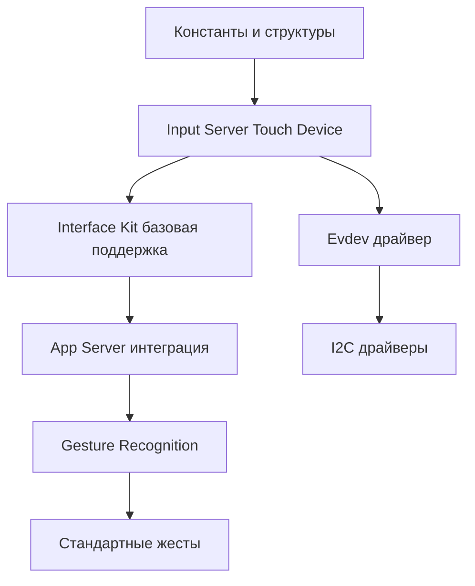

# План реализации Touch-поддержки в Haiku OS на основе Qt

## 1. Исходные файлы Qt для изучения

### 1.1 Базовая обработка событий
```
qtbase/src/gui/kernel/
├── qevent.h                    # Определение QTouchEvent, QNativeGestureEvent
├── qevent.cpp                  # Реализация touch-событий
├── qtouchdevice.h              # Интерфейс touch-устройства
├── qtouchdevice.cpp            # Реализация абстракции устройства
└── qguiapplication.cpp        # Диспетчеризация touch-событий (строки ~2800-3200)
```

### 1.2 Распознавание жестов
```
qtbase/src/widgets/kernel/
├── qgesture.h                  # Базовые классы жестов
├── qgesture.cpp                # Реализация QGesture
├── qgesturemanager.cpp         # Менеджер распознавания (ВАЖНО!)
├── qgesturerecognizer.h        # Интерфейс распознавателя
└── qstandardgestures.cpp       # Стандартные жесты (pinch, swipe, tap)
```

### 1.3 Платформо-специфичная интеграция
```
qtbase/src/plugins/platforms/xcb/
├── qxcbconnection_xi2.cpp      # Linux/X11 touch через XInput2
└── qxcbwindow.cpp              # Обработка window-событий

qtbase/src/plugins/platforms/android/
├── androidjniinput.cpp         # Android touch bridge
└── qandroideventdispatcher.cpp # Диспетчер событий
```

### 1.4 Input обработка
```
qtbase/src/platformsupport/input/
├── evdevtouch/
│   ├── qevdevtouchhandler.cpp  # Чтение из /dev/input/eventX
│   └── qevdevtouchmanager.cpp  # Управление устройствами
└── libinput/
    └── qlibinputtouch.cpp      # Обработка через libinput
```

## 2. Файлы Haiku OS для модификации

### 2.1 Input Server
```
haiku/src/servers/input/
├── InputServer.cpp             # МОДИФИЦИРОВАТЬ: добавить TouchDevice
├── InputServer.h               # Добавить методы для touch
├── InputServerDevice.cpp       # База для BTouchDevice
└── AddOnManager.cpp            # Загрузка touch-драйверов

СОЗДАТЬ НОВЫЕ:
├── TouchDevice.cpp             # Новый класс для touch-устройств
├── TouchDevice.h
├── GestureRecognizer.cpp       # Распознавание жестов
└── GestureRecognizer.h
```

### 2.2 Драйверы устройств
```
haiku/src/add-ons/kernel/drivers/input/
СОЗДАТЬ ДИРЕКТОРИЮ:
└── touchscreen/
    ├── TouchscreenDriver.cpp   # Базовый драйвер
    ├── TouchscreenDriver.h
    ├── evdev/                   # Поддержка Linux touch устройств
    │   └── evdev_touch.cpp
    └── i2c/                     # I2C touch контроллеры
        ├── goodix.cpp
        └── synaptics_i2c.cpp
```

### 2.3 Interface Kit модификации
```
haiku/src/kits/interface/
├── View.cpp                    # МОДИФИЦИРОВАТЬ: добавить TouchDown(), TouchMoved(), TouchUp()
├── Window.cpp                  # МОДИФИЦИРОВАТЬ: диспетчеризация touch
└── Message.cpp                 # Возможно потребуется расширить

СОЗДАТЬ НОВЫЕ:
├── TouchEvent.cpp              # BTouchEvent класс
├── TouchEvent.h
├── Gesture.cpp                 # BGesture иерархия
└── Gesture.h
```

### 2.4 App Server
```
haiku/src/servers/app/
├── EventDispatcher.cpp         # МОДИФИЦИРОВАТЬ: обработка touch-событий
├── EventDispatcher.h
├── InputManager.cpp            # МОДИФИЦИРОВАТЬ: управление touch-устройствами
├── Desktop.cpp                 # МОДИФИЦИРОВАТЬ: глобальные жесты
└── Window.cpp                  # МОДИФИЦИРОВАТЬ: hit-testing для touch

СОЗДАТЬ:
└── TouchManager.cpp            # Централизованное управление touch
```

### 2.5 Заголовочные файлы
```
haiku/headers/os/interface/
├── View.h                      # Добавить virtual методы для touch
├── Window.h                    # Добавить touch-related методы
└── GraphicsDefs.h              # Добавить константы событий

СОЗДАТЬ:
├── TouchEvent.h                # Публичный API
└── Gesture.h                   # Публичный API жестов
```

## 3. Пошаговый план реализации

### Фаза 1: Базовая инфраструктура (2-3 недели)

#### Шаг 1.1: Определение констант и структур
```cpp
// В haiku/headers/os/support/SupportDefs.h добавить:
enum {
    B_TOUCH_DOWN = '_TDN',
    B_TOUCH_MOVED = '_TMV',
    B_TOUCH_UP = '_TUP',
    B_TOUCH_CANCELLED = '_TCL',
    B_MULTITOUCH_BEGIN = '_MTB',
    B_MULTITOUCH_END = '_MTE'
};

// В haiku/headers/os/interface/TouchEvent.h создать:
struct touch_point {
    int32 id;
    BPoint position;
    BPoint screen_position;
    float pressure;
    float radius;
    uint32 flags;
};

class BTouchEvent : public BMessage {
    // Основываясь на QTouchEvent из qtbase/src/gui/kernel/qevent.h
};
```

#### Шаг 1.2: Модификация Input Server
Изучить `qtbase/src/platformsupport/input/evdevtouch/qevdevtouchhandler.cpp` и адаптировать для Haiku:

```cpp
// haiku/src/servers/input/TouchDevice.cpp
class TouchDevice : public BInputServerDevice {
    // Адаптировать логику из QEvdevTouchHandler::processInputEvent
    status_t HandleEvent(const input_event& event);
    void SendTouchMessage(const touch_point& point, uint32 what);
};
```

### Фаза 2: Драйверы устройств (3-4 недели)

#### Шаг 2.1: Evdev драйвер
Основываясь на `qtbase/src/platformsupport/input/evdevtouch/qevdevtouchhandler.cpp`:

```cpp
// haiku/src/add-ons/kernel/drivers/input/touchscreen/evdev/evdev_touch.cpp
- Читать из /dev/input/eventX
- Парсить ABS_MT_* события
- Конвертировать в Haiku touch_point структуры
```

#### Шаг 2.2: I2C драйверы
Изучить драйверы Linux kernel:
- `linux/drivers/input/touchscreen/goodix.c`
- Адаптировать для Haiku kernel API

### Фаза 3: Interface Kit интеграция (3-4 недели)

#### Шаг 3.1: Расширение BView
```cpp
// haiku/src/kits/interface/View.cpp
// Добавить методы по аналогии с Qt QWidget::event()
virtual void TouchDown(BTouchEvent* event);
virtual void TouchMoved(BTouchEvent* event);
virtual void TouchUp(BTouchEvent* event);
```

#### Шаг 3.2: Gesture Recognition
Адаптировать из `qtbase/src/widgets/kernel/qgesturemanager.cpp`:

```cpp
// haiku/src/kits/interface/GestureRecognizer.cpp
class BGestureRecognizer {
    // Портировать логику QGestureManager::filterEvent
    BGesture* Recognize(BTouchEvent* event);
};
```

### Фаза 4: App Server модификации (2-3 недели)

#### Шаг 4.1: Event Dispatcher
Изучить `qtbase/src/gui/kernel/qguiapplication.cpp` метод `processMouseEvent()`:

```cpp
// haiku/src/servers/app/EventDispatcher.cpp
void EventDispatcher::DispatchTouchEvent(BTouchEvent* event) {
    // Адаптировать логику hit-testing из Qt
    // Найти целевое окно и view
    // Отправить сообщение
}
```

### Фаза 5: Жесты высокого уровня (2 недели)

#### Шаг 5.1: Стандартные жесты
Портировать из `qtbase/src/widgets/kernel/qstandardgestures.cpp`:
- Pinch (масштабирование)
- Pan (перемещение)
- Swipe (смахивание)
- Tap (касание)
- Long press (долгое нажатие)

## 4. Тестирование

### Создать тестовое приложение
```cpp
// haiku/src/tests/servers/input/TouchTest/
class TouchTestView : public BView {
    void TouchDown(BTouchEvent* event) override {
        printf("Touch at %.2f, %.2f\n", 
               event->TouchPoint(0).position.x,
               event->TouchPoint(0).position.y);
    }
};
```

## 5. Приоритеты и зависимости



## 6. Полезные инструменты отладки

### Qt инструменты для изучения
- Запустить Qt примеры с `QT_LOGGING_RULES="qt.qpa.input*=true"`
- Использовать `examples/touch/` для понимания поведения

### Haiku инструменты
- Расширить `input_server` с debug выводом
- Создать `TouchMonitor` приложение по аналогии с `qtbase/examples/touch/fingerpaint`

## 7. Ключевые различия Qt vs Haiku

| Qt | Haiku | Адаптация |
|---|---|---|
| QEvent | BMessage | Добавить новые константы what |
| QWidget::event() | BView::MessageReceived() | Добавить виртуальные методы Touch*() |
| QGestureManager (singleton) | BGestureRecognizer (per-window) | Упростить архитектуру |
| Signal/Slot | BLooper/BHandler | Использовать существующую модель |

## 8. Примерный timeline

- **Недели 1-2**: Базовая инфраструктура
- **Недели 3-6**: Драйверы и низкоуровневая поддержка
- **Недели 7-10**: Interface Kit и App Server
- **Недели 11-12**: Жесты и тестирование
- **Недели 13-14**: Отладка и оптимизация

## 9. Дополнительные ресурсы

- Qt Git: https://code.qt.io/cgit/qt/qtbase.git/
- Qt Touch примеры: `qtbase/examples/touch/`
- Linux Multi-touch Protocol: `Documentation/input/multi-touch-protocol.rst`
- Haiku Interface Kit: https://www.haiku-os.org/docs/api/group__interface.html